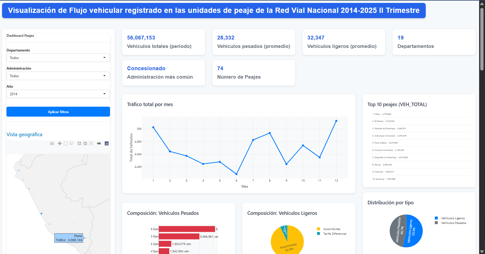

# Dashboard de Tráfico Vehicular en Peajes – R Shiny

Aplicación web desarrollada en **R Shiny** para analizar el flujo vehicular registrado en los peajes del Perú. Incluye visualizaciones interactivas, KPIs principales, clustering y modelos de predicción.

---

## Características
- Dashboard interactivo con **Shiny + Plotly**
- KPIs dinámicos: totales, promedios y estadísticas por filtros
- Gráficos: líneas, barras, pie charts, boxplots y mapa básico
- **Clustering (K-Means)** y matriz de correlación
- **Modelos predictivos:** ARIMA, Random Forest y Prophet
- Exportación de reportes y datos filtrados en Excel

---

## Tecnologías usadas
- **R 4.x**
- **R Shiny**
- dplyr, ggplot2, plotly, DT  
- forecast, randomForest, prophet  
- writexl  

---

## Instalación
```
install.packages(c(
  "shiny", "dplyr", "ggplot2", "plotly", "DT",
  "forecast", "randomForest", "prophet", "writexl"
))
```
## URL desplegada:
https://qe7j2m-alex-raul0cruz.shinyapps.io/visualizacion_del_trafico_vehicular_en_peajes/

📸 ****


